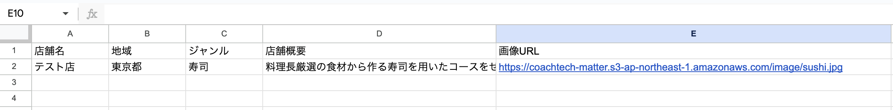
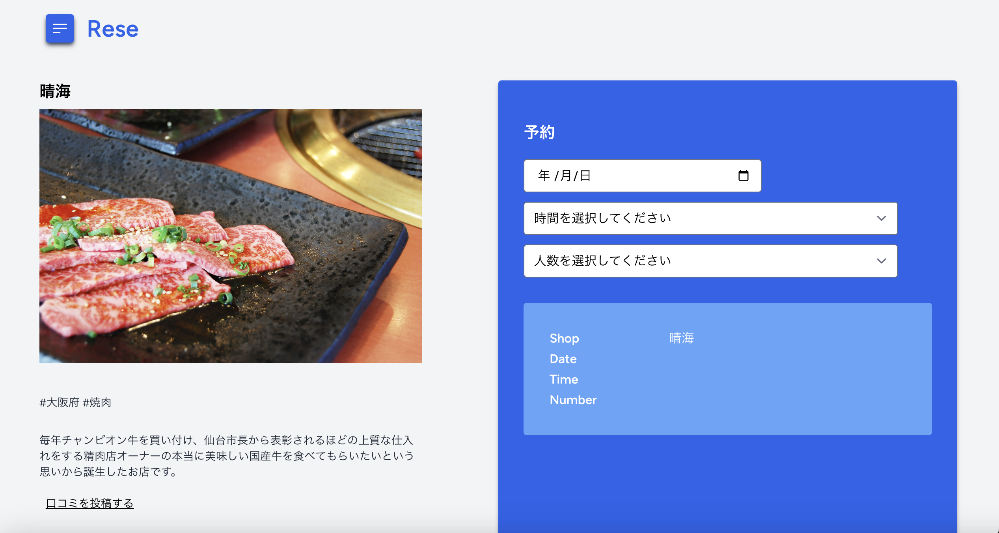
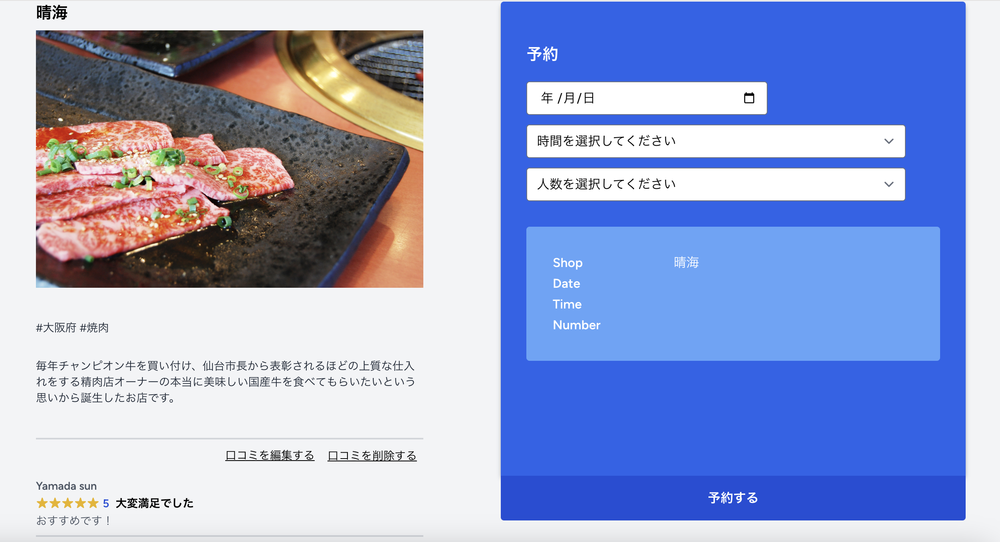
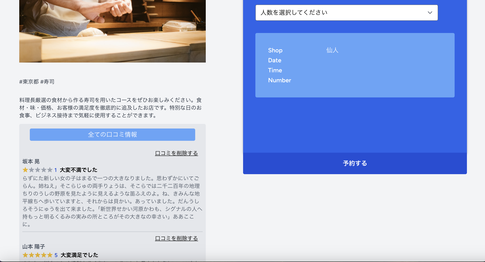
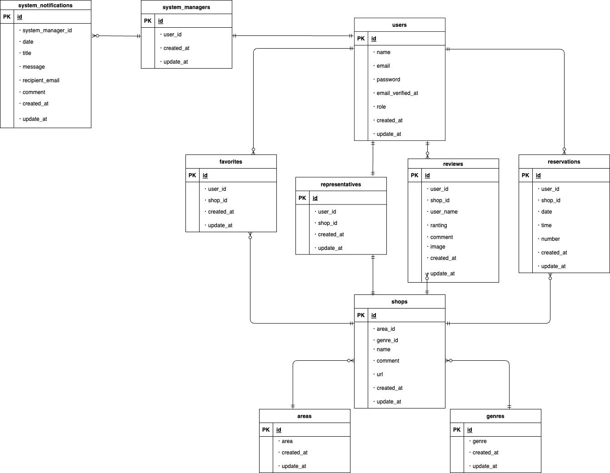

## Rese

### “Rese（リーズ）”は飲食店予約サービスです。<br>


会員登録をすることで、登録されているお店の店舗情報を閲覧できるだけではなく、各店舗の口コミチェック、お店のお気に入り登録、予約を行うことができるようになります。<br>
【ゲストユーザートップページ】localhost<br>
【ログインユーザートップページ】localhost/shop/index<br>
(ログインしたままでも localhost にアクセスできますがメニュー内のログインをクリックすると/shop/index に遷移します)<br>
【店舗代表者専用トップページ】localhost/shop/management<br>
【システム管理者専用トップページ】localhost/management<br>

---

## 作成した目的

飲食店の方から、「外部の飲食店予約サービスは手数料を取られるので自社で予約サービスを持ちたい。」というご依頼を頂き、Rese を作成致しました。

---

## デプロイ先

http://43.206.227.87/<br>
※ 上級模擬案件の範囲のみ<br>
※ メールサーバーがまだ準備できていないためメールに関する機能は現在使えません。<br>


---

## 機能一覧

**【ゲストユーザー】**<br>

-   飲食店一覧取得/表示機能
-   飲食店詳細取得/表示機能
-   エリア/ジャンル/店名での検索機能
-   会員登録機能(メール認証あり)

**【一般ユーザー】**<br>
ダミーデータ：【Email】testhanako@gmail.com【Password】testhanako<br>

-   ログイン機能
-   ログアウト機能
-   ユーザー情報取得/表示機能(マイページ)
-   ユーザー飲食店お気に入り一覧取得/表示機能(マイページ)
-   ユーザー飲食店予約情報取得/表示機能(マイページ)
-   飲食店一覧取得/表示機能
-   飲食店詳細取得/表示機能
-   エリア/ジャンル/店名での検索機能
-   店舗一覧ソート機能<br>ランダム/評価が高い順/評価が低い順の3種類で並び替えが可能です。<br>希望の並べ方を選択後、Enterをクリックすると並び変わります。(検索機能との併用はできません)<br>何も選択していない場合はshop_id順に表示されます。<br>※ レビューが1件もない店舗は評価が高い順、低い順ともに最後尾に表示されます。<br>※ 評価数はページアクセス時に毎回取得し反映させています。
-   飲食店お気に入り追加機能
-   飲食店お気に入り削除機能
-   飲食店予約情報追加機能
-   飲食店予約情報更新機能
-   飲食店予約情報削除機能
-   5 段階評価&レビュー作成機能(利用後の店舗のみレビュー作成可能)<br>上級案件提出時に作成していたreviewsテーブルuser_name(口コミ用の表示名)/ranting/commentにimageカラムを追加
-   5 段階評価&レビュー更新機能(自分が作成したレビューのみ更新可能)
-   5 段階評価&レビュー削除機能(自分が作成したレビューのみ削除可能)<br>口コミ機能の詳細は下記をご確認ください
-   決済機能 stripe での決済機能<br>(user のマイページに表示される【支払いをする】ボタンから決済可能)<br>※テストの際は下記カード情報をご使用ください。<br>【番号:4242 4242 4242 4242】【日付：任意の将来の日付】【セキュリティコード:任意の 3 桁の数字】

**【店舗代表者権限を持つユーザー】**<br>
ダミーデータ：【Email】sennin_representative@gmail.com【Password】sennin_representative<br>
(一般ユーザーの機能プラス下記機能が使用可能)<br>

-   新規飲食店情報作成機能
-   飲食店情報更新機能
-   担当店舗の予約一覧取得/表示機能
-   担当店舗の予約の個別取得/表示機能<br>(予約一覧に表示されるユーザー名をクリックすると予約の個別詳細ページへ遷移)
-   QR コードでの予約詳細確認機能<br>(user のマイページにて QR コードを表示 ※URL は店舗代表者が確認できる予約の個別詳細ページ)

**【システム管理者権限を持つユーザー】**<br>
ダミーデータ：【Email】system_manager@gmail.com【Password】system1manager<br>
(一般ユーザーの機能プラス下記機能が使用可能)<br>

-   飲食店店舗代表者登録機能
-   CSVファイルインポートによる新規飲食店情報作成機能<br>/csvにアクセス、もしくは/managementの右上「Shop Create」からアップロードページに遷移できます。<br>※CSVファイルの記述方法は下記をご確認ください。
-   システム管理者から全ユーザーへのメール送信
-   予約当日に予約情報のリマインダー送信
-   5 段階評価&レビュー削除機能(自分の作成したレビューだけではなく全てのレビューを削除可能)<br>口コミ機能の削除の詳細は下記をご確認ください

**⚫︎ 認証メール送信のタイミング ⚫︎**<br>
会員登録後に表示される thanks ページにて『ログインする』ボタンをクリックする必要があるため、下記タイミングにて認証メールが送信されます。<br>
register ページにてフォーム入力 → thanks ページに表示される『ログインする』ボタンをクリック →login フォームを入力 → 認証メールが送信される<br>

**⚫︎ メール送信確認ついて ⚫︎**<br>
Laravel sail に含まれる MailPit 機能を使用してご確認いただけます。<br>
【http://localhost:8025】<br>
にアクセスしていただくと MailPit 画面が表示されます。

**⚫︎ CSV ファイルの記述方法について ⚫︎**<br>

-   説明：
    この CSV ファイルは、店舗情報を格納するために使用されます。<br>
    各行には、店舗名、地域、ジャンル、店舗概要、画像 URL が含まれます。
-   各列に含まれる情報の詳細説明：<br>
    ・店舗名: 店舗の名前を表します。最大 50 文字までの文字列である必要があります。<br>
    ・地域: 店舗の所在地の地域を表します。有効な値は「東京都」「大阪府」「福岡県」のいずれかです。<br>
    ・ジャンル: 店舗のジャンルを表します。有効な値は、「寿司」「焼肉」「イタリアン」「居酒屋」「ラーメン」のいずれかです。<br>
    ・店舗概要: 店舗の概要や特徴を表します。最大 400 文字までの文字列である必要があります。<br>
    ・画像 URL: 店舗の画像の URL を表します。有効な画像ファイル形式は jpeg または png です。<br>
-   サンプル CSV ファイル：
    以下は、店舗情報を含むサンプルの CSV データです。<br>
    店舗名,地域,ジャンル,店舗概要,画像 URL<br>
    仙人,東京都,寿司,料理長厳選の食材から作る寿司を用いたコースをぜひお楽しみください。食材・味・価格、お客様の満足度を徹底的に追及したお店です。特別な日のお食事、ビジネス接待まで気軽に使用することができます。,https://coachtech-matter.s3-ap-northeast-1.amazonaws.com/image/sushi.jpg<br>
    牛助,大阪府,焼肉,焼肉業界で 20 年間経験を積み、肉を熟知したマスターによる実力派焼肉店。長年の実績とお付き合いをもとに、なかなか食べられない希少部位も仕入れております。また、ゆったりとくつろげる空間はお仕事終わりの一杯や女子会にぴったりです。,https://coachtech-matter.s3-ap-northeast-1.amazonaws.com/image/yakiniku.jpg<br>
-   サンプル CSV ファイル作成方法(Google スプレッドシートの場合)：<br>
    下記の図のように 1 行目にヘッダーとなる項目を、2 行目にデータを入力してください。<br>
    そして、ファイル → ダウンロード → カンマ区切り形式(.csv)を選択すると CSV ファイルとしてダウンロードされます。
    

**⚫︎ 口コミ機能(5段階評価&レビュー)について ⚫︎**<br>
上級模擬案件時に作成していた機能、デザイン、条件はそのまま使用し、足りなかった部分を追加しました。<br>
- 口コミ作成(一般ユーザー)：利用歴(現時刻より以前の予約歴)があれば、下記のように店舗詳細ページ(shop_detail.blade.php)に「口コミを投稿する」が表示されます。(店舗代表者/システム管理者のアカウントでログインした場合は表示されません)「口コミを投稿する」をクリックすると口コミ作成ページへ遷移されます。<br>


- 口コミ更新/削除(一般ユーザー)：口コミがreviewsテーブルに保存されている場合は、下記のように店舗詳細ページ(shop_detail.blade.php)に「口コミを編集する」「口コミを削除する」が表示されます。(店舗代表者/システム管理者のアカウントでログインした場合は表示されません)「口コミを編集する」をクリックすると口コミ編集ページへ遷移されます。「口コミを削除する」をクリックするとレビューが削除されます<br>


- 口コミ削除(システム管理者)：システム管理者のアカウントでログインしている場合は、下記のように店舗詳細ページ(shop_detail.blade.php)の全レビュー右上に「口コミを削除する」が表示されます。(店舗代表者/一般ユーザーのアカウントでログインした場合は表示されません)「口コミを削除する」をクリックするとレビューが削除されます<br>


---

## 使用技術

-   Laravel v10.42.0
-   Laravel Sail(Docker, Nginx, MYSQL, Mailpit)
-   Laravel Breeze
-   Laravel ストレージ使用(店舗イメージ画像保存)
-   PHP v8.3.2-1
-   Tailwind CSS
-   Javascript v10.3.0<br>
    ・ハンバーガーメニュー<br>
    ・トップページでのEnterで並び替え/検索<br>
    ・入力内容確認欄(予約フォーム内)への即時反映<br>
    ・alert message 　のみ
-   Pagination
-   バリデーション<br>(認証/予約/レビュー/店舗情報作成・更新/店舗代表者作成/メール送信)
-   simplesoftwareio/simple-qrcode v4.2
-   Stripe SDK(stripe/stripe-php) v13.13
-   AWS(EC2、RDS、S3)

---

## 環境構築

※ Docker をインストールしていない方は下記より docker をインストールしてください。<br>
https://www.docker.com/ja-jp/products/docker-desktop/

### 【新規プロジェクトの作成「rese-project」】<br>

cd コマンドでプロジェクトを作成したいルートに移動し、下記コマンドを実行してください。

```jsx
$ curl -s https://laravel.build/rese-project | bash
```

最後に Password 入力を求められるので、入力すれば作成完了です。

### 【Laravel sail を起動】<br>

プロジェクトのルートに移動し、下記コマンドで Laravel sail を起動させます。

```jsx
$ ./vendor/bin/sail up -d
```

確認のため localhost へアクセスすると Laravel の Welcome ページを見ることができます。

### 【エイリアスを作成】<br>

ホームディレクトリに.zshrc ファイルを作成し下記を入力します。<br>
(入力する際は i を押すと入力モードに切り替わります。入力が終わったら esc→:wq で入力終了と保存を行なってください。)<br>
**alias sail="vendor/bin/sail"**<br>
※ 今後のコマンドは"vendor/bin/sail"ではなく"sail"で記述していきます。

### 【Laravel sail を止める】<br>

```jsx
$ sail stop
```

### 【phpMyAdmin の準備】<br>

-   Laravel sail を stop した状態で、docker-compose.yml ファイルを編集します。<br>
    mysql の下(timeout: 5s)53 行目〜redis:の間に下記を追記します。

```jsx
phpmyadmin:
image: phpmyadmin/phpmyadmin
links:
- mysql:mysql
ports:
- 8080:80
environment:
MYSQL_USERNAME: '${DB_USERNAME}'
MYSQL_ROOT_PASSWORD: '${DB_PASSWORD}'
PMA_HOST: mysql
networks:
- sail
```

-   .env ファイルでデータベースの設定を確認し、下記にアクセスしてログインします。<br>
    【localhost:8080】<br>
    ※ ユーザー名・パスワードは先程.env ファイルで確認したものを入力してください。<br>
    プロジェクト名のデータベースが作成されていれば成功です！

### 【認証機能 Breeze をインストール】<br>

-   Laravel sail を起動し、プロジェクトのルートで Breeze パッケージをいれるコマンドを実行します。<br>

```jsx
$ sail composer require laravel/breeze --dev
```

下記コマンドで Breeze をインストールします。<br>

```jsx
$ sail artisan breeze:install
```

※ 3 つの質問が表示されるので希望に沿って選んで実行してください。<br>
(今回私が選んだ内容は下記の通りです)<br>
・Which Breeze stack would you like to install? → **Blade with Alpine**<br>
・Would you like dark mode support? → **No**<br>
・Which testing framework do you prefer? → **PHPUnit**<br>
Breeze scaffolding installed successfully.と表示されれば成功です！

-   Tailwind CSS を反映させます。<br>
    (作業用のターミナルとは別にターミナルを開き、下記コマンドを実行してください。)<br>

```jsx
$ sail npm run dev
```

作業用のターミナルに戻り、マイグレートします。<br>

```jsx
$ sail artisan migrate
```

これで rese_project のデータベース内に users テーブルが作成され会員登録が可能な状態となりました。

### 【日本語化の設定をする】

-   まずはロケールとタイムゾーンの設定を行います。<br>
    プロジェクト内の config/app.php を変更していきます。<br>
    ・timezone の変更(73 行目あたり) → **'timezone' => 'Asia/Tokyo',**<br>
    ・locale の変更(86 行目あたり) → **'locale' => 'ja',**<br>
    ・faker_locale の変更(112 行目あたり) → **'faker_locale' => 'ja_JP',**<br>

-   次に lang ディレクトリを作成するため、下記コマンドを実行します。<br>

```jsx
$ sail artisan lang:publish
```

lang/en が作成されました。<br>

-   あわせて lang/ja(日本語版)フォルダを作成します。<br>
    (今回、Laravel Breeze 日本語化パッケージをインストールさせて頂きました)<br>
    GitHub : https://github.com/askdkc/breezejp<br>
    下記コマンドを実行すると lang/ja(日本語版)フォルダが作成されます。<br>

```jsx
$ sail composer require askdkc/breezejp --dev
$ sail artisan breezejp
```

### 【QR コード生成のため simplesoftwareio/simple-qrcode をインストール】<br>

-   Laravel sail を起動し、プロジェクトのルートで simplesoftwareio/simple-qrcode パッケージをインストールします。<br>

```jsx
$ sail composer require simplesoftwareio/simple-qrcode
```

### 【決済機能 strip 導入のため Stripe SDK(stripe/stripe-php) をインストール】<br>

-   Stripe の公式ウェブサイト（https://stripe.com）にアクセスし、テスト用APIキーを取得します。<br>
-   取得したテスト用 API キーを.env ファイルに追記し、環境変数の設定を行います。<br>
-   Laravel sail を起動し、プロジェクトのルートで stripe/stripe-php をインストールします。<br>

```jsx
$ sail composer require stripe/stripe-php
```

### 【タイムスケジュラーの利用】<br>

-   必要なファイルを作成、下記のコマンドでタスクを実行する権限を与えます。<br>

```jsx
$ chmod +x app/Console/Commands/SendReservationReminders.php
```

-   docker-compose.yml ファイルのサービス名と同じレベルの場所に下記を追加<br>

```jsx
cron: image: alpine;
volumes: -".:/var/www/html" -
    "./schedule.sh:/etc/crontabs/www-data/schedule.sh";
restart: unless - stopped;
command: "crond -f";
depends_on: -mysql;
```

-   下記のコマンドで docker コンテナ内に入ります。<br>

```jsx
$ docker-compose exec laravel.test bash
```

-   docker コンテナ内で下記をコマンドします。<br>

```jsx
$ php artisan schedule:run
```

-   exit で docker コンテナ内から出て docker を再起動します。<br>

```jsx
$ docker-compose down
$ docker-compose up -d
```

-   タスクを実行したいときは下記コマンドを実行しておきます。<br>

```jsx
$ sail artisan schedule:work
```

-   タスク実行時間に MailPit にメールが届けば成功です！<br>
-   タスク実行の時間にはターミナルにも下記のように表示されます。<br>

```jsx
2024-03-12 18:00:00 Running ['artisan' send:reservation-reminders]  491ms DONE
  ⇂ '/usr/bin/php8.3' 'artisan' send:reservation-reminders > '/dev/null' 2>&1
```

### 【開発中に docker を止めた場合は必ず下記をコマンドしてください】<br>

-   docker を起動させます。<br>

```jsx
$ sail up -d
```

-   Tailwindcss を反映させるため下記を実行しておいてください。<br>

```jsx
$ sail npm run dev
```

---

## テーブル設計

### users テーブル

|      Column       |     Type     |   Options   |
| :---------------: | :----------: | :---------: |
|       name        | varchar(191) | null: false |
|       email       | varchar(191) | null: false |
|     password      | varchar(191) | null: false |
| email_verified_at |  timestamp   |     ———     |
|       role        | varchar(191) |     ———     |
|    created_at     |  timestamp   |     ———     |
|    updated_at     |  timestamp   |     ———     |

### shops テーブル

|   Column   |     Type     |   Options   |
| :--------: | :----------: | :---------: |
|  area_id   |    bigint    | null: false |
|  genre_id  |    bigint    | null: false |
|    name    | varchar(191) | null: false |
|  comment   |     text     | null: false |
|    url     |     text     | null: false |
| created_at |  timestamp   |     ———     |
| updated_at |  timestamp   |     ———     |

### areas テーブル

|   Column   |     Type     |   Options   |
| :--------: | :----------: | :---------: |
|    area    | varchar(191) | null: false |
| created_at |  timestamp   |     ———     |
| updated_at |  timestamp   |     ———     |

### genres テーブル

|   Column   |     Type     |   Options   |
| :--------: | :----------: | :---------: |
|   genre    | varchar(191) | null: false |
| created_at |  timestamp   |     ———     |
| updated_at |  timestamp   |     ———     |

### reservations テーブル

|   Column   |   Type    |   Options   |
| :--------: | :-------: | :---------: |
|  user_id   |  bigint   | null: false |
|  shop_id   |  bigint   | null: false |
|    date    |   date    | null: false |
|    time    |   time    | null: false |
|   number   |  integer  | null: false |
| created_at | timestamp |     ———     |
| updated_at | timestamp |     ———     |

### favorites テーブル

|   Column   |   Type    |   Options   |
| :--------: | :-------: | :---------: |
|  user_id   |  bigint   | null: false |
|  shop_id   |  bigint   | null: false |
| created_at | timestamp |     ———     |
| updated_at | timestamp |     ———     |

### reviews テーブル

|   Column   |     Type     |   Options   |
| :--------: | :----------: | :---------: |
|  user_id   |    bigint    |     ———     |
|  shop_id   |    bigint    | null: false |
| user_name  | varchar(191) | null: false |
|  ranting   |   integer    | null: false |
|  comment   |     text     | null: false |
| created_at |  timestamp   |     ———     |
| updated_at |  timestamp   |     ———     |

### representatives テーブル

|   Column   |   Type    |   Options   |
| :--------: | :-------: | :---------: |
|  user_id   |  bigint   |     ———     |
|  shop_id   |  bigint   | null: false |
| created_at | timestamp |     ———     |
| updated_at | timestamp |     ———     |

### system_managers テーブル

|   Column   |   Type    |   Options   |
| :--------: | :-------: | :---------: |
|  user_id   |  bigint   | null: false |
| created_at | timestamp |     ———     |
| updated_at | timestamp |     ———     |

### system_notifications テーブル

|      Column       |     Type     |   Options   |
| :---------------: | :----------: | :---------: |
| system_manager_id |    bigint    |     ———     |
|       date        |   datetime   | null: false |
|       title       | varchar(191) | null: false |
|      message      |     text     | null: false |
|  recipient_email  | varchar(191) | null: false |
|    created_at     |  timestamp   |     ———     |
|    updated_at     |  timestamp   |     ———     |

---

## ER 図


