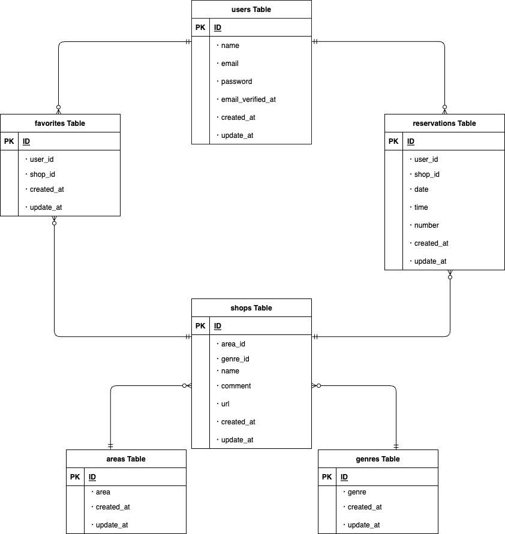

## Rese
### “Rese（リーズ）”は飲食店予約サービスです。<br>
会員登録することで、お気に入りのお店を登録したり予約を行うことができます。<br>

***

## 作成した目的

飲食店の方から、「外部の飲食店予約サービスは手数料を取られるので自社で予約サービスを持ちたい。」<br>というご依頼を頂き、Reseを作成致しました。

***

## アプリケーションURL
http://54.168.148.66/login<br>

***

## 機能一覧
* 会員登録機能(メール認証あり)
* ログイン機能
* ログアウト機能
* ユーザー情報機能(マイページ)
* ユーザー飲食店お気に入り一覧取得(マイページ)
* ユーザー飲食店予約情報取得(マイページ)
* 飲食店一覧取得
* 飲食店詳細取得
* 飲食店お気に入り追加
* 飲食店お気に入り削除
* 飲食店予約情報追加
* 飲食店予約情報削除
* エリア/ジャンル/店名で検索する

**メール送信確認ついて**
Laravel sailに含まれるMailPit機能を使用してご確認いただけます。<br>
【http://localhost:8025】にアクセスしていただくとMailPit画面が表示されます。

***

## 使用技術
* Laravel 10.42.0
* Laravel Sail(Docker, Nginx, MYSQL, Mailpit)
* Laravel Breeze
* PHP 8.3.2-1
* Tailwind CSS
* 
* 
* 
* 
* AWS(EC2, RDS)

***

## 環境構築
※ Dockerをインストールしていない方は下記よりdockerをインストールしてください。<br>
https://www.docker.com/ja-jp/products/docker-desktop/

【新規プロジェクトの作成「rese-project」】
cdコマンドで作成したい場所に移動して下記コマンドを実行してください。

```jsx
$ **curl -s https://laravel.build/rese-project | bash**
```

最後にPasswordn入力を求められるので、入力すれば作成完了です。

Laravel sailを起動
cdコマンドでプロジェクトまで移動します。
cd rese-laravel

下記コマンドでsailを起動させます。
**./vendor/bin/sail up -d**

確認のためlocalhostへアクセスするとLaravelのWelcomeページが見れます。

エイリアスを作成
ホームディレクトリに.zshrcファイルを作成し下記を入力
(入力する際はiを、入力終了時はesc→:wqをクリックで保存)
**alias sail="vendor/bin/sail"**

※ 今後のコマンドは**"vendor/bin/sail"ではなく"sail"で記述していきます。**

Laravel sailを止める(cdでプロジェクトに移動)
**sail stop**

【phpMyAdminの準備】
(sail stopした状態で行います)
docker-compose.ymlファイルを編集します。
mysqlの下(timeout: 5s)53行目〜redis:の間に下記を追記します。

```jsx
**phpmyadmin:
image: phpmyadmin/phpmyadmin
links:
- mysql:mysql
ports:
- 8080:80
environment:
MYSQL_USERNAME: '${DB_USERNAME}'
MYSQL_ROOT_PASSWORD: '${DB_PASSWORD}'
PMA_HOST: mysql
networks:
- sail**
```

.envファイルでデータベースの設定を確認する

【localhost:8080】にアクセスしてログインする。
※ ユーザー名・パスワードは先程envファイルで確認したものを入力してください。
プロジェクト名のデータベースが作成されていれば成功です！

【認証機能Breezeをインストール】
(Laravel sailを起動した状態で行います)

プロジェクトの場所で、Breezeパッケージをいれるコマンドを実行します。

```jsx
$ **sail composer require laravel/breeze --dev**
```

下記コマンドでBreezeをインストールします。

```jsx
$ **sail artisan breeze:install**
```

3つの質問が表示されるので希望に沿って選んで実行してください。
(今回私が選んだ内容は下記の通りです)
・Which Breeze stack would you like to install? → **Blade with Alpine**
・Would you like dark mode support? → **No**
・Which testing framework do you prefer? → **PHPUnit**
Breeze scaffolding installed successfully.と表示されれば成功です！

Tailwind CSSを反映させます。(作業とは別のターミナルを開きます)

```jsx
$ **sail npm run dev**
```

マイグレートする。

```jsx
$ sail artisan migrate
```

rese_projectのデータベース内にusersテーブルが作成され会員登録が可能な状態となりました。

【日本語化の設定をする】

ロケールとタイムゾーンの設定(デフォルトの設定)
プロジェクト内の**config/app.php**を変更していきます。
・timezoneの変更(73行目あたり)→**'timezone' => 'Asia/Tokyo',**
・localeの変更(86行目あたり)→**'locale' => 'ja',**
・faker_localeの変更(112行目あたり)→**'faker_locale' => 'ja_JP',**

langディレクトリの作成
下記コマンドを実行します。

```jsx
$ **sail artisan lang:publish**
```

lang/enが作成されます。次はlang/ja(日本語版)フォルダを作成します。
(今回、Laravel Breeze日本語化パッケージをインストールさせて頂きました)

GitHub : https://github.com/askdkc/breezejp

***

## テーブル設計
### usersテーブル
|Column|Type|Options|
|:---:|:---:|:---:|
|name|varchar(191)|null: false|
|email|varchar(191)|null: false|
|password|varchar(191)|null: false|
|email_verified_at|timestamp|———|
|created_at|timestamp|———|
|updated_at|timestamp|———|

### shopsテーブル
|Column|Type|Options|
|:---:|:---:|:---:|
|area_id|bigint|null: false|
|genre_id|bigint|null: false|
|name|varchar(191)|null: false|
|comment|text|———|
|url|text|———|
|created_at|timestamp|———|
|updated_at|timestamp|———|

### areasテーブル
|Column|Type|Options|
|:---:|:---:|:---:|
|area|varchar(191)|null: false|
|created_at|timestamp|———|
|updated_at|timestamp|———|

### genresテーブル
|Column|Type|Options|
|:---:|:---:|:---:|
|genre|varchar(191)|null: false|
|created_at|timestamp|———|
|updated_at|timestamp|———|

### reservationsテーブル
|Column|Type|Options|
|:---:|:---:|:---:|
|user_id|bigint|null: false|
|shop_id|bigint|null: false|
|date|date|null: false|
|time|time|———|
|number|integer|———|
|created_at|timestamp|———|
|updated_at|timestamp|———|

### favoritesテーブル
|Column|Type|Options|
|:---:|:---:|:---:|
|user_id|bigint|null: false|
|shop_id|bigint|null: false|
|created_at|timestamp|———|
|updated_at|timestamp|———|

***

## ER図
