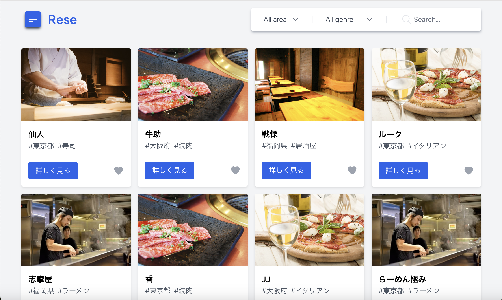

## Rese

### “Rese（リーズ）”は飲食店予約サービスです。<br>


会員登録をすることで、登録されているお店の店舗情報を閲覧できるだけではなく、各店舗の口コミチェック、お店のお気に入り登録、予約を行うことができるようになります。<br>

---

## 作成した目的

飲食店の方から、「外部の飲食店予約サービスは手数料を取られるので自社で予約サービスを持ちたい。」というご依頼を頂き、Rese を作成致しました。

---

## アプリケーション URL

<br>

---

## 機能一覧

-   会員登録機能(メール認証あり)
-   ログイン機能
-   ログアウト機能
-   ユーザー情報機能(マイページ)
-   ユーザー飲食店お気に入り一覧取得(マイページ)
-   ユーザー飲食店予約情報取得(マイページ)
-   飲食店一覧取得
-   飲食店詳細取得
-   飲食店お気に入り追加
-   飲食店お気に入り削除
-   飲食店予約情報追加
-   飲食店予約情報更新
-   飲食店予約情報削除
-   5 段階評価&レビュー作成<br>(利用後の店舗のみ詳細ページにてレビュー作成可能)
-   エリア/ジャンル/店名で検索する
-   飲食店情報作成
-   飲食店情報更新
-   担当店舗の予約一覧取得
-   担当店舗の予約の個別取得<br>(予約一覧に表示されるユーザー名をクリックすると予約の個別詳細ページへ遷移)
-   QRコードでの予約詳細確認<br>(userのマイページにてQRコードを表示 ※URLは店舗代表者が確認できる予約の個別詳細ページ)
-   決済機能stripeでの決済<br>(userのマイページに表示される【支払いをする】ボタンから決済可能)<br>※テストの際は下記カード情報をご使用ください。<br>【番号:4242 4242 4242 4242】【日付：任意の将来の日付】【セキュリティコード:任意の3桁の数字】
-   飲食店店舗代表者登録
-   システム管理者から全ユーザーへのメール送信
-   予約当日に予約情報のリマインダー送信

**認証メール送信のタイミング**<br>
会員登録後に表示される thanks ページにて『ログインする』ボタンをクリックする必要があるため、下記タイミングにて認証メールが送信されます。<br>
register ページにてフォーム入力 → thanks ページに表示される『ログインする』ボタンをクリック →login フォームを入力 → 認証メールが送信される<br>

**メール送信確認ついて**<br>
Laravel sail に含まれる MailPit 機能を使用してご確認いただけます。<br>
【http://localhost:8025】<br>
にアクセスしていただくと MailPit 画面が表示されます。

---

## 使用技術

-   Laravel v10.42.0
-   Laravel Sail(Docker, Nginx, MYSQL, Mailpit)
-   Laravel Breeze
-   Laravel ストレージ使用(店舗イメージ画像保存)
-   PHP v8.3.2-1
-   Tailwind CSS
-   Javascript v10.3.0<br>
    ・ハンバーガーメニュー<br>
    ・トップページでの Enter 検索<br>
    ・入力内容確認欄(予約フォーム内)への即時反映<br>
    ・alert message 　のみ
-   Pagination
-   バリデーション<br>(認証/予約/レビュー/店舗情報作成・更新/店舗代表者作成/メール送信)
-   simplesoftwareio/simple-qrcode v4.2
-   Stripe SDK(stripe/stripe-php) v13.13
-   AWS(EC2, RDS, S3)

---

## 環境構築

※ Docker をインストールしていない方は下記より docker をインストールしてください。<br>
https://www.docker.com/ja-jp/products/docker-desktop/

### 【新規プロジェクトの作成「rese-project」】<br>

cd コマンドでプロジェクトを作成したいルートに移動し、下記コマンドを実行してください。

```jsx
$ curl -s https://laravel.build/rese-project | bash
```

最後に Password 入力を求められるので、入力すれば作成完了です。

### 【Laravel sail を起動】<br>

プロジェクトのルートに移動し、下記コマンドで Laravel sail を起動させます。

```jsx
$ ./vendor/bin/sail up -d
```

確認のため localhost へアクセスすると Laravel の Welcome ページを見ることができます。

### 【エイリアスを作成】<br>

ホームディレクトリに.zshrc ファイルを作成し下記を入力します。<br>
(入力する際は i を押すと入力モードに切り替わります。入力が終わったら esc→:wq で入力終了と保存を行なってください。)<br>
**alias sail="vendor/bin/sail"**<br>
※ 今後のコマンドは"vendor/bin/sail"ではなく"sail"で記述していきます。

### 【Laravel sail を止める】<br>

```jsx
$ sail stop
```

### 【phpMyAdmin の準備】<br>

-   Laravel sail を stop した状態で、docker-compose.yml ファイルを編集します。<br>
    mysql の下(timeout: 5s)53 行目〜redis:の間に下記を追記します。

```jsx
phpmyadmin:
image: phpmyadmin/phpmyadmin
links:
- mysql:mysql
ports:
- 8080:80
environment:
MYSQL_USERNAME: '${DB_USERNAME}'
MYSQL_ROOT_PASSWORD: '${DB_PASSWORD}'
PMA_HOST: mysql
networks:
- sail
```

-   .env ファイルでデータベースの設定を確認し、下記にアクセスしてログインします。<br>
    【localhost:8080】<br>
    ※ ユーザー名・パスワードは先程.env ファイルで確認したものを入力してください。<br>
    プロジェクト名のデータベースが作成されていれば成功です！

### 【認証機能 Breeze をインストール】<br>

-   Laravel sail を起動し、プロジェクトのルートで Breeze パッケージをいれるコマンドを実行します。<br>

```jsx
$ sail composer require laravel/breeze --dev
```

下記コマンドで Breeze をインストールします。<br>

```jsx
$ sail artisan breeze:install
```

※ 3 つの質問が表示されるので希望に沿って選んで実行してください。<br>
(今回私が選んだ内容は下記の通りです)<br>
・Which Breeze stack would you like to install? → **Blade with Alpine**<br>
・Would you like dark mode support? → **No**<br>
・Which testing framework do you prefer? → **PHPUnit**<br>
Breeze scaffolding installed successfully.と表示されれば成功です！

-   Tailwind CSS を反映させます。<br>
    (作業用のターミナルとは別にターミナルを開き、下記コマンドを実行してください。)<br>

```jsx
$ sail npm run dev
```

作業用のターミナルに戻り、マイグレートします。<br>

```jsx
$ sail artisan migrate
```

これで rese_project のデータベース内に users テーブルが作成され会員登録が可能な状態となりました。

### 【日本語化の設定をする】

-   まずはロケールとタイムゾーンの設定を行います。<br>
    プロジェクト内の config/app.php を変更していきます。<br>
    ・timezone の変更(73 行目あたり) → **'timezone' => 'Asia/Tokyo',**<br>
    ・locale の変更(86 行目あたり) → **'locale' => 'ja',**<br>
    ・faker_locale の変更(112 行目あたり) → **'faker_locale' => 'ja_JP',**<br>

-   次に lang ディレクトリを作成するため、下記コマンドを実行します。<br>

```jsx
$ sail artisan lang:publish
```

lang/en が作成されました。<br>

-   あわせて lang/ja(日本語版)フォルダを作成します。<br>
    (今回、Laravel Breeze 日本語化パッケージをインストールさせて頂きました)<br>
    GitHub : https://github.com/askdkc/breezejp<br>
    下記コマンドを実行すると lang/ja(日本語版)フォルダが作成されます。<br>

```jsx
$ sail composer require askdkc/breezejp --dev
$ sail artisan breezejp
```

### 【QR コード生成のため simplesoftwareio/simple-qrcode をインストール】<br>

-   Laravel sail を起動し、プロジェクトのルートで simplesoftwareio/simple-qrcode パッケージをインストールします。<br>

```jsx
$ sail composer require simplesoftwareio/simple-qrcode
```

### 【決済機能 strip 導入のため Stripe SDK(stripe/stripe-php) をインストール】<br>

-   Stripeの公式ウェブサイト（https://stripe.com）にアクセスし、テスト用APIキーを取得します。<br>
-   取得したテスト用APIキーを.envファイルに追記し、環境変数の設定を行います。<br>
-   Laravel sail を起動し、プロジェクトのルートで stripe/stripe-php をインストールします。<br>

```jsx
$ sail composer require stripe/stripe-php
```

### 【タイムスケジュラーの利用】<br>

-   必要なファイルを作成、下記のコマンドでタスクを実行する権限を与えます。<br>

```jsx
$ chmod +x app/Console/Commands/SendReservationReminders.php
```

-   docker-compose.ymlファイルのサービス名と同じレベルの場所に下記を追加<br>
```jsx
    cron:
        image: alpine
        volumes:
            - ".:/var/www/html"
            - "./schedule.sh:/etc/crontabs/www-data/schedule.sh"
        restart: unless-stopped
        command: "crond -f"
        depends_on:
            - mysql
```

-   下記のコマンドでdockerコンテナ内に入ります。<br>

```jsx
$ docker-compose exec laravel.test bash
```

-   dockerコンテナ内で下記をコマンドします。<br>

```jsx
$ php artisan schedule:run
```

-   exitでdockerコンテナ内から出てdockerを再起動します。<br>

```jsx
$ docker-compose down
$ docker-compose up -d
```

-   タスクを実行したいときは下記コマンドを実行しておきます。<br>

```jsx
$ sail artisan schedule:work
```

-   タスク実行時間にMailPitにメールが届けば成功です！<br>
-   タスク実行の時間にはターミナルにも下記のように表示されます。<br>

```jsx
2024-03-12 18:00:00 Running ['artisan' send:reservation-reminders]  491ms DONE
  ⇂ '/usr/bin/php8.3' 'artisan' send:reservation-reminders > '/dev/null' 2>&1 
```
### 【開発中にdockerを止めた場合は必ず下記をコマンドしてください】<br>

-   dockerを起動させます。<br>

```jsx
$ sail up -d
```
-   Tailwindcssを反映させるため下記を実行しておいてください。<br>

```jsx
$ sail npm run dev
```

---

## テーブル設計

### users テーブル

|      Column       |     Type     |   Options   |
| :---------------: | :----------: | :---------: |
|       name        | varchar(191) | null: false |
|       email       | varchar(191) | null: false |
|     password      | varchar(191) | null: false |
| email_verified_at |  timestamp   |     ———     |
|       role        | varchar(191) |     ———     |
|    created_at     |  timestamp   |     ———     |
|    updated_at     |  timestamp   |     ———     |

### shops テーブル

|   Column   |     Type     |   Options   |
| :--------: | :----------: | :---------: |
|  area_id   |    bigint    | null: false |
|  genre_id  |    bigint    | null: false |
|    name    | varchar(191) | null: false |
|  comment   |     text     | null: false |
|    url     |     text     | null: false |
| created_at |  timestamp   |     ———     |
| updated_at |  timestamp   |     ———     |

### areas テーブル

|   Column   |     Type     |   Options   |
| :--------: | :----------: | :---------: |
|    area    | varchar(191) | null: false |
| created_at |  timestamp   |     ———     |
| updated_at |  timestamp   |     ———     |

### genres テーブル

|   Column   |     Type     |   Options   |
| :--------: | :----------: | :---------: |
|   genre    | varchar(191) | null: false |
| created_at |  timestamp   |     ———     |
| updated_at |  timestamp   |     ———     |

### reservations テーブル

|   Column   |   Type    |   Options   |
| :--------: | :-------: | :---------: |
|  user_id   |  bigint   | null: false |
|  shop_id   |  bigint   | null: false |
|    date    |   date    | null: false |
|    time    |   time    | null: false |
|   number   |  integer  | null: false |
| created_at | timestamp |     ———     |
| updated_at | timestamp |     ———     |

### favorites テーブル

|   Column   |   Type    |   Options   |
| :--------: | :-------: | :---------: |
|  user_id   |  bigint   | null: false |
|  shop_id   |  bigint   | null: false |
| created_at | timestamp |     ———     |
| updated_at | timestamp |     ———     |

### reviews テーブル

|   Column   |     Type     |   Options   |
| :--------: | :----------: | :---------: |
|  user_id   |    bigint    |     ———     |
|  shop_id   |    bigint    | null: false |
| user_name  | varchar(191) | null: false |
|  ranting   |   integer    | null: false |
|  comment   |     text     | null: false |
| created_at |  timestamp   |     ———     |
| updated_at |  timestamp   |     ———     |

### representatives テーブル

|   Column   |   Type    |   Options   |
| :--------: | :-------: | :---------: |
|  user_id   |  bigint   |     ———     |
|  shop_id   |  bigint   | null: false |
| created_at | timestamp |     ———     |
| updated_at | timestamp |     ———     |

### system_managers テーブル

|   Column   |   Type    |   Options   |
| :--------: | :-------: | :---------: |
|  user_id   |  bigint   | null: false |
| created_at | timestamp |     ———     |
| updated_at | timestamp |     ———     |

### system_notifications テーブル

|      Column       |     Type     |   Options   |
| :---------------: | :----------: | :---------: |
| system_manager_id |    bigint    |     ———     |
|       date        |   datetime   | null: false |
|       title       | varchar(191) | null: false |
|      message      |     text     | null: false |
|  recipient_email  | varchar(191) | null: false |
|    created_at     |  timestamp   |     ———     |
|    updated_at     |  timestamp   |     ———     |

---

## ER 図


